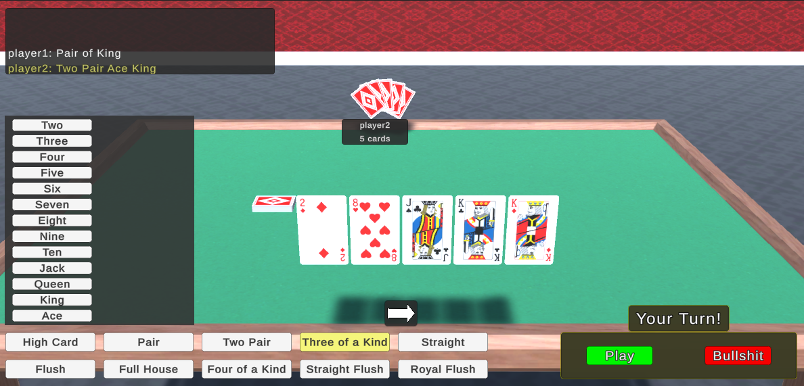
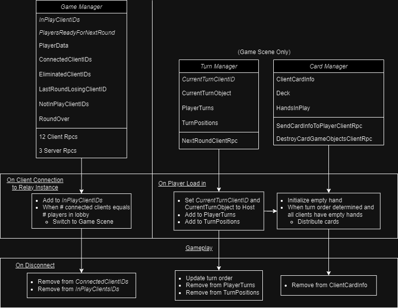
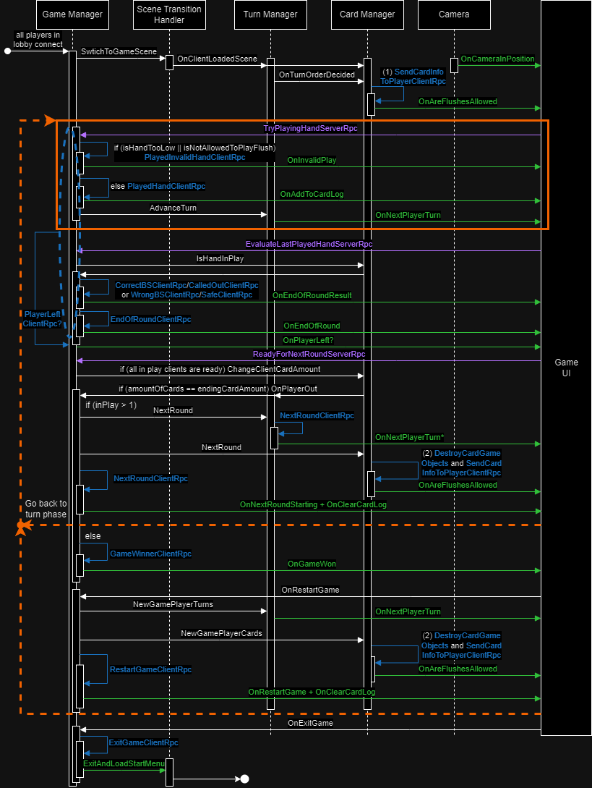

# :spades: :hearts: PokerHandsBSGame :diamonds: :clubs:
My first 3D Unity game :beginner:

Multiplayer and networking :globe_with_meridians: made possible with 
- [Netcode for GameObjects](https://docs-multiplayer.unity3d.com/)
- [Relay](https://unity.com/products/relay)
- [Lobby](https://unity.com/products/lobby)

The UI was built entirely using [TextMeshPro](https://docs.unity3d.com/Manual/com.unity.textmeshpro.html) :pencil:

Card and table assets provided by [Game Asset Studio](https://assetstore.unity.com/packages/3d/props/tools/free-playing-cards-pack-154780) :pray:

## Standout Files :eyes:
- Managers
  - [Game](Assets/Scripts/GameManager.cs)
  - [Card](Assets/Scripts/CardManager.cs), includes [distributing cards to players](Assets/Scripts/CardManager.cs#L391)
    - [Hands in play](Assets/Scripts/Gameplay/Objects/HandsInPlay.cs#L88) calculates what poker hands exist
  - [Lobby](Assets/Scripts/LobbyManager.cs)
  - [Turns](Assets/Scripts/TurnManager.cs)
- Entities
  - [All enums and card enum extensions](Assets/Scripts/Enums.cs)
  - [Deck](Assets/Scripts/Gameplay/Objects/Deck.cs)
  - [Card](Assets/Scripts/Gameplay/Objects/Card.cs)
  - [Base poker hand and all types of hands](Assets/Scripts/Gameplay/Objects/PokerHand.cs)
    - [Poker hand factory](Assets/Scripts/Gameplay/Objects/PokerHandFactory.cs)
  - GameObjects
    - [Opponent hand](Assets/Scripts/Gameplay/Objects/OpponentHand.cs)
- Interactions and input
  - [Player controller](Assets/Scripts/PlayerController.cs)
  - [Opponent cards](Assets/Scripts/Gameplay/Objects/OpponentHand.cs)
  - [Card dragging](Assets/Scripts/Draggable.cs)
- UI
  - [Selecting hands to play](Assets/Scripts/Gameplay/UI/HandSelectionUI.cs) consists of two parts -
    - [Card rank selection](Assets/Scripts/Gameplay/UI/CardRankChoicesUI.cs)
    - [Card suit selection](Assets/Scripts/Gameplay/UI/CardSuitChoicesUI.cs)
  - [Player actions log](Assets/Scripts/Gameplay/UI/PlayedHandLogUI.cs)
  - Animations
    - [Interface](Assets/Scripts/Gameplay/Interfaces/IAnimatable.cs) that is implemented by different types of UI animations -
    - [Translate](Assets/Scripts/Gameplay/UI/TransitionableUIBase.cs)
    - [Resize](Assets/Scripts/Gameplay/UI/ResizableUIBase.cs)
    - [Rotate](Assets/Scripts/Gameplay/UI/RotatableUIBase.cs)
    - [Fade](Assets/Scripts/Gameplay/UI/FadeableUIBase.cs)

## Manager Classes :bookmark_tabs:
Simplified diagram (UML-like) of the server/host side of the main classes, their *networked members* and server/host logic

## Gameplay Events :arrow_right_hook:
RPCs and events that are used during the game in a pseudo sequence diagram

### Shortcomings :triangular_flag_on_post:

(1) and (2) are very similar, they could probably be looped.

\* `OnNextPlayerTurn` is actually invoked twice; the observer on the current turn client ID `NetworkVariable` and `NextRoundClientRPC` both fire the event.

## Nice to Have's :ideograph_advantage:
- Interactivity in player's own cards
- Tooltip containing information about player's own cards for clarity
- Animations for players' played hands, based on their own cards and the played hands log
- Localization
- CPU players

## Things to do Better :white_flag:
- Take more advantage of prefabs
- Having to go through lobby creation everytime to test gameplay (better scene management and scene independence during development?)
- Screen size and UI management
- Database or a relational database design-like class structure
  - Primary keys for hashing in dictionaries and foreign keys to connect to other objects
- Order of event invoking
- Graceful disconnect behaviour
  - An idea I had was only on client disconnect `IsClient && !IsServer`, a server RPC is sent to signal that this client is disconnecting (can determine if the host actually disconnected)
